# WarpCustomVM Architecture Diagrams

This document contains visual architecture diagrams in Mermaid format. These can be viewed in any Markdown viewer that supports Mermaid (GitHub, GitLab, VS Code with extensions, etc.).

## Table of Contents
1. [Component Architecture](#component-architecture)
2. [Outgoing Message Flow](#outgoing-message-flow)
3. [Incoming Message Flow](#incoming-message-flow)
4. [Consensus Synchronization](#consensus-synchronization)
5. [Data Flow](#data-flow)
6. [State Management](#state-management)

---

## Component Architecture

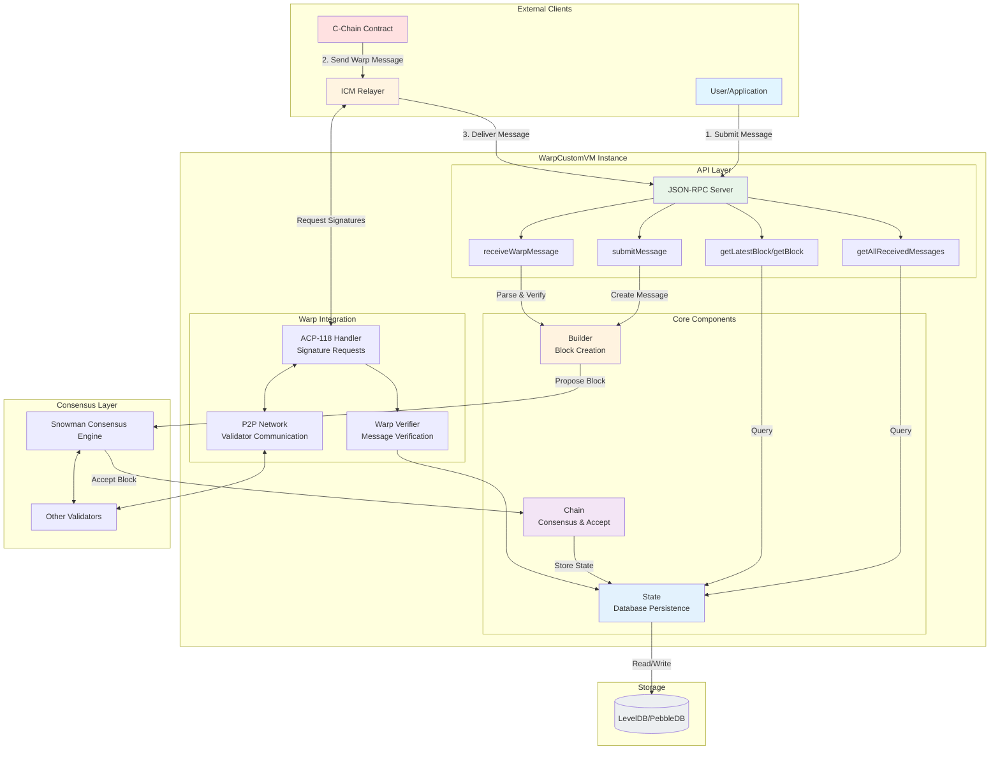

---

## Outgoing Message Flow (WarpCustomVM → C-Chain)

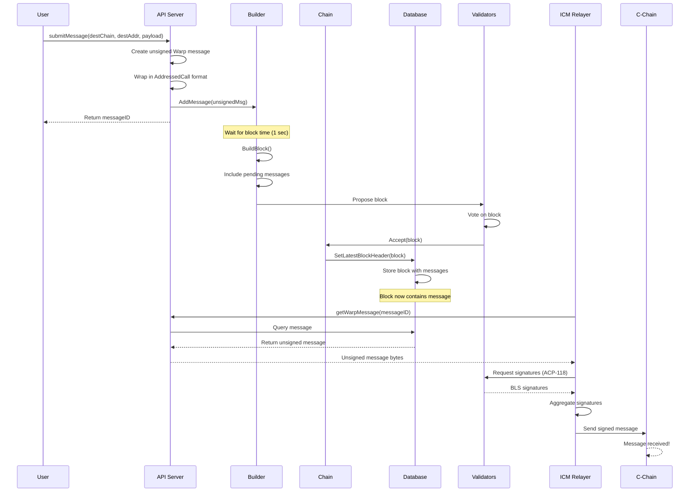

---

## Incoming Message Flow (C-Chain → WarpCustomVM)

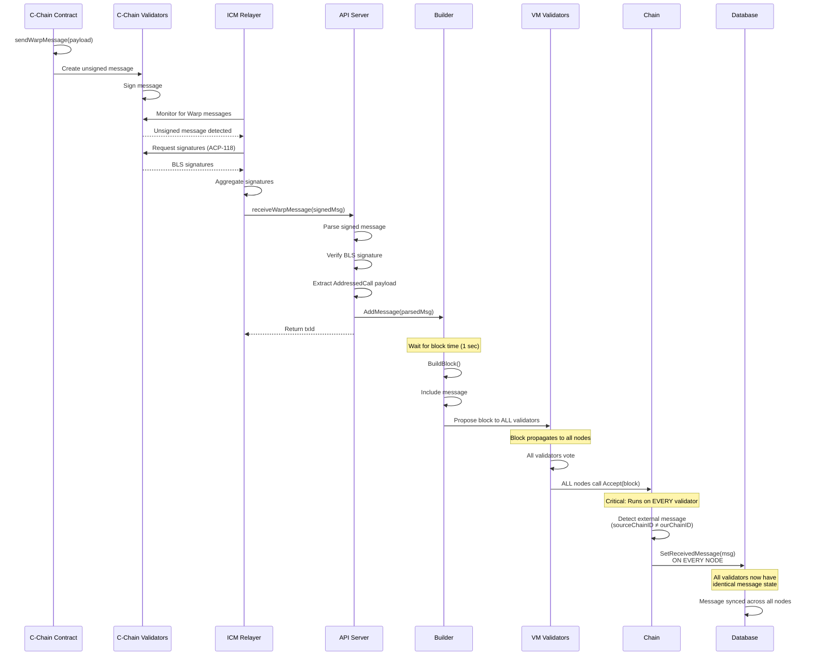

---

## Consensus Synchronization

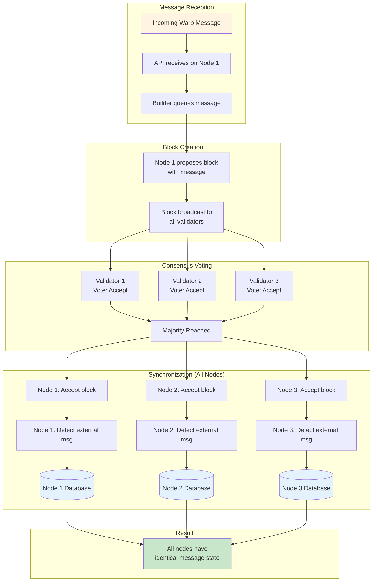

---

## Data Flow

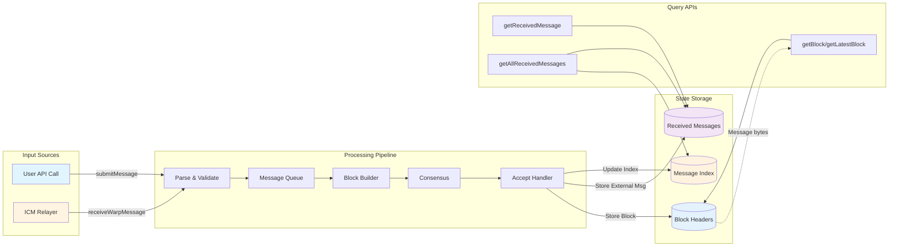

---

## State Management

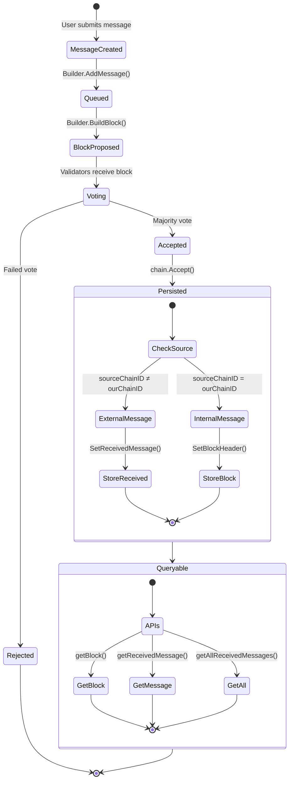

---

## API Request Flow

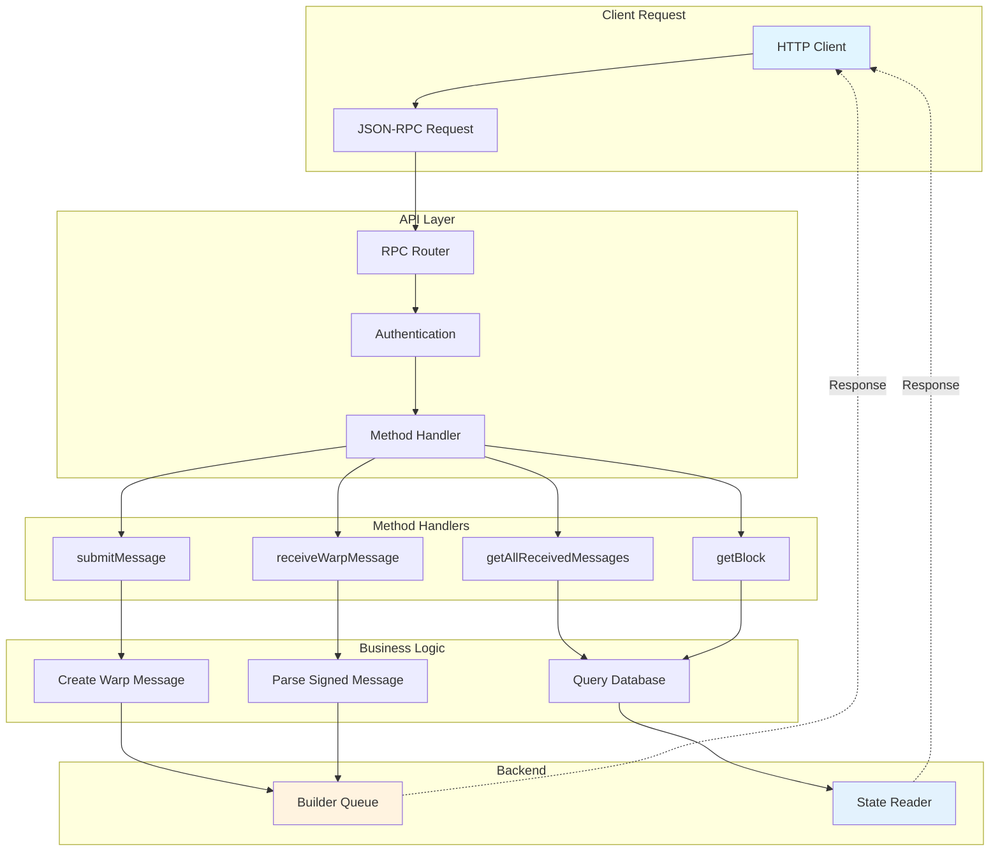

---

## Block Structure

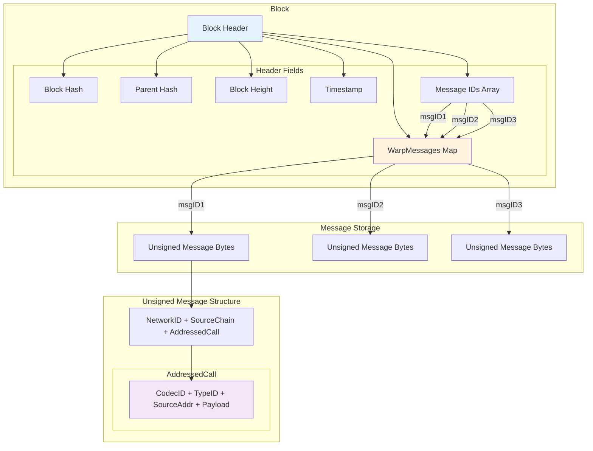

---

## Database Schema

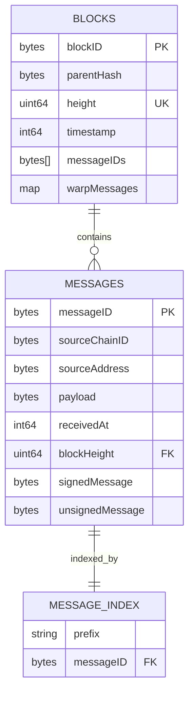

---

## Warp Message Lifecycle

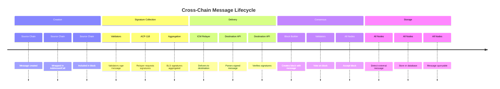

---

## Error Handling Flow

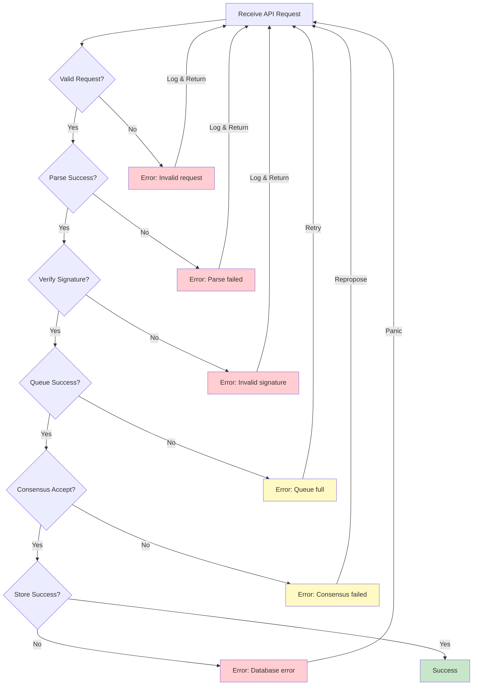

---

## Performance Metrics

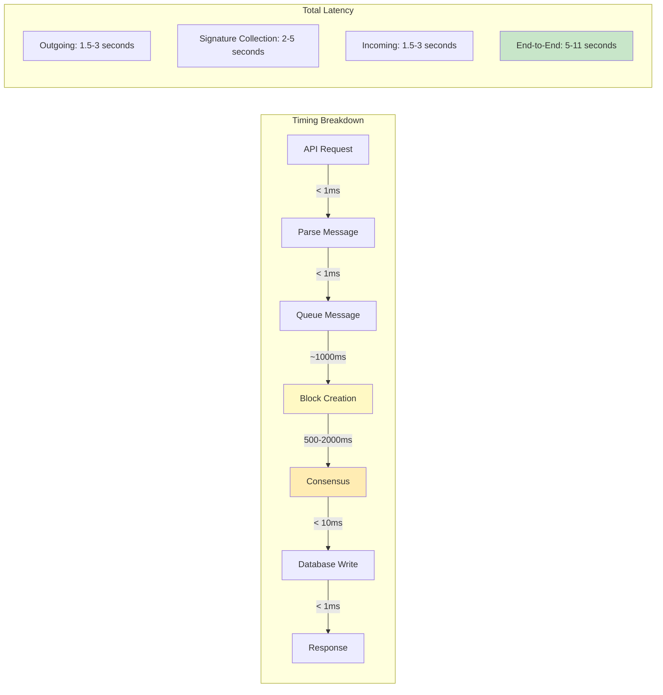

---

## How to View These Diagrams

### In GitHub/GitLab
Simply view this file - Mermaid diagrams render automatically.

### In VS Code
1. Install extension: "Markdown Preview Mermaid Support"
2. Open this file
3. Press `Ctrl+Shift+V` (or `Cmd+Shift+V` on Mac)

### Online Viewers
- [Mermaid Live Editor](https://mermaid.live/)
- Copy any diagram code and paste to edit/view

### Export as Images
Use Mermaid CLI:
```bash
npm install -g @mermaid-js/mermaid-cli
mmdc -i DIAGRAMS.md -o diagrams.pdf
```
